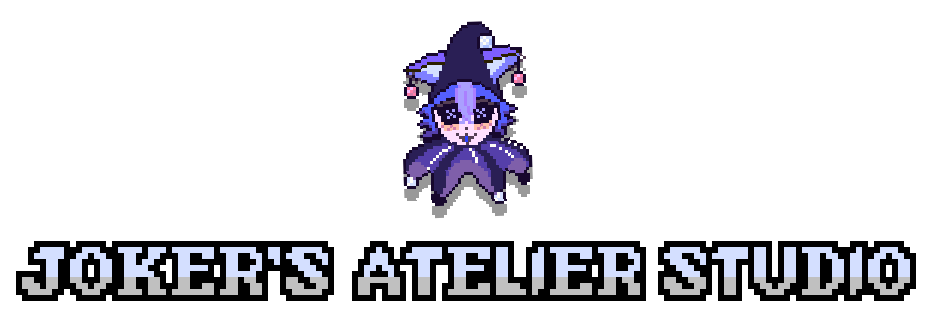
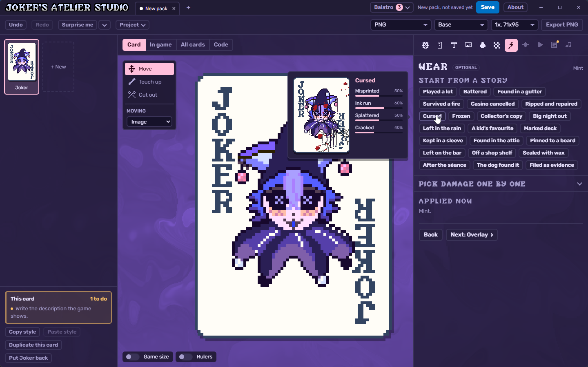
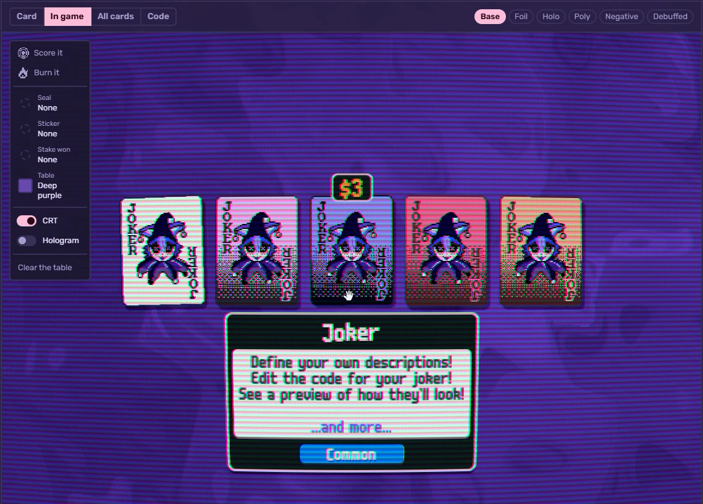
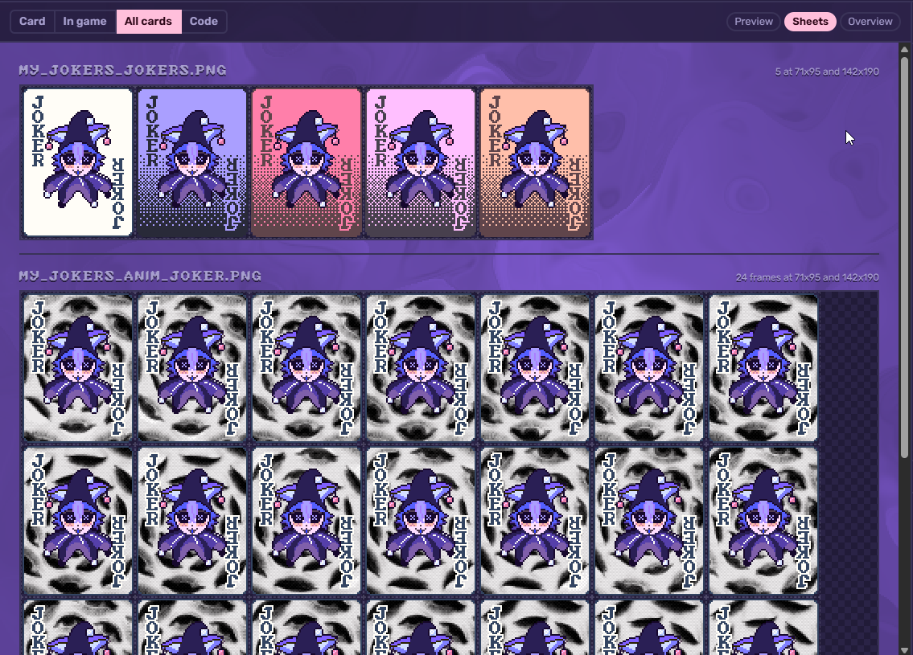
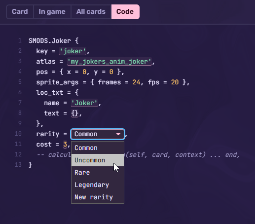

**Turn any picture into a Balatro card.**

[-009DFF?style=for-the-badge>)](https://github.com/nanoqoi/jokers-atelier-studio/releases/latest/download/Jokers-Atelier-Studio-Mac-Apple-Silicon.dmg)
[-009DFF?style=for-the-badge>)](https://github.com/nanoqoi/jokers-atelier-studio/releases/latest/download/Jokers-Atelier-Studio-Mac-Intel.dmg)

[All downloads and what changed](https://github.com/nanoqoi/jokers-atelier-studio/releases/latest)

## What it makes

Joker's Atelier Studio takes a drawing, a photo or a screenshot and turns it into a card that looks like it came with the game. Every card comes out at Balatro's own size, pixel for pixel, and ready to drop into a mod.

- Jokers, tarots, vouchers, booster packs, deck backs, tags, blind chips, enhancements and seals
- The game's colours, or any colours at all
- Worn edges, foils, a floating layer like the legendary jokers have, and animation
- A card table that shows the cards the way the game draws them, with editions, seals and stickers
- The sprite sheets a mod needs, built from all the cards at once

  
  

The Code view writes the Steamodded code for each card. Values like the rarity can be picked from a list right in the code.

  

## Download and install

Click the button for the computer above. The download starts straight away.

To check which Mac it is, open the Apple menu and choose **About This Mac**. A **Chip** line that starts with "Apple" means Apple chip. A **Processor** line that says "Intel" means Intel.

The app isn't signed with a paid Apple or Microsoft certificate yet, so the computer asks before it opens it the first time.

- **Windows:** On "Windows protected your PC", click **More info**, then **Run anyway**.
- **Mac:** Open the `.dmg` and drag the app into **Applications**. Open it once and close the warning. Then go to **System Settings**, then **Privacy & Security**, scroll down and click **Open Anyway**.
- **Mac, if it says the app is damaged:** Open **Terminal**, type `xattr -cr ` with a space at the end, drag the app from **Applications** onto the Terminal window and press Return. Then open the app again.
- **Linux:** Right-click the `.AppImage`, open **Properties**, and turn on **Allow executing file as program**. Then double-click it. On Ubuntu or Debian, the `.deb` from the [downloads page](https://github.com/nanoqoi/jokers-atelier-studio/releases/latest) installs like any other app.

To update, download the new version and install it over the old one. Saved cards stay where they are.

## Saving cards

The Studio saves two kinds of file. Double-click either one to open it again.

- A `.jkr` file is one card.
- A `.jkrp` file is a pack of cards, the whole mod in one file.

Both show up as a picture of the cards in File Explorer and Finder.

## Something wrong, or an idea?

[Open an issue](https://github.com/nanoqoi/jokers-atelier-studio/issues/new/choose) and pick the kind that fits. It takes a free GitHub account. A screenshot helps a lot.

## Credits

Joker's Atelier Studio is a fan-made tool by [nanoqoi](https://github.com/nanoqoi). It isn't made by or connected to LocalThunk or Playstack. [Balatro](https://playbalatro.com) belongs to them.

Some of the card frames, the pack wrap and the in-game shine effects are Balatro's own artwork and code. The card font is m6x11plus by Daniel Linssen, as extended for Balatro. The joker font is JOKERFONT by Unexian. The interface uses Rubik and JetBrains Mono, both under the SIL Open Font License 1.1.
